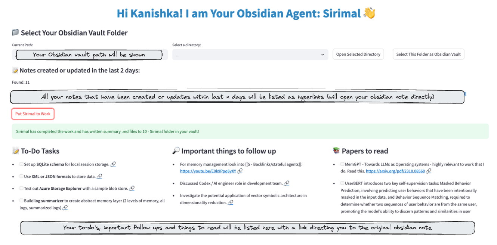

# Obsidian Agent: Sirimal



## Overview
Sirimal is a Streamlit-based Obsidian agent designed to help manage and summarize your Obsidian notes. It focuses on actionable tasks, follow-ups, and papers to read, making it easier to keep track of your work and research.

## Features
- **File Browser**: Select your Obsidian vault folder and navigate through directories.
- **Recent Notes**: Lists recently updated or created notes with direct links to open them in Obsidian.
- **Task Extraction**: Uses OpenAI's GPT-4o to extract actionable tasks, follow-ups, and papers to read from your notes.
- **Summary Files**: Writes summary markdown files in your vault, deduplicating tasks.

## Prerequisites
- Python 3.6 or higher
- An OpenAI API key
- Obsidian installed and configured

## Installation
1. Clone the repository:
   ```bash
   git clone <repository-url>
   cd <repository-directory>
   ```

2. Create a virtual environment and activate it:
   ```bash
   python -m venv .venv
   source .venv/bin/activate  # On Windows, use `.venv\Scripts\activate`
   ```

3. Install the required packages:
   ```bash
   pip install -r requirements.txt
   ```

4. Create a `.env` file in the project directory and add your OpenAI API key:
   ```
   OPENAI_API_KEY=your_openai_api_key
   ```

## Configuration
Edit the `config.py` file to customize the following settings:
- `DEFAULT_VAULT_PATH`: Path to your Obsidian vault.
- `DEFAULT_VAULT_NAME`: Name of your Obsidian vault.
- `AGENT_NAME`: Name of your agent.
- `DAYS_TO_LOOK_BACK`: Number of days to look back for recent documents.
- `SUMMARY_SAVE_PATH`: Path where summary files are saved.
- `ALLOWED_FOLDERS`: List of folders to include in the search.
- `EXTRACTION_PROMPT`: Prompt used for OpenAI extraction.

## Usage
1. Run the Streamlit app:
   ```bash
   streamlit run app.py
   ```

2. Open your web browser and navigate to the provided local URL (usually `http://localhost:8501`).

3. Use the file browser to select your Obsidian vault folder.

4. Click on "Put Sirimal to Work" to extract tasks and save summary files to your obsidian vault.

## Contributing
Contributions are welcome! Please feel free to submit a Pull Request.

## License
This project is licensed under the MIT License - see the LICENSE file for details. 